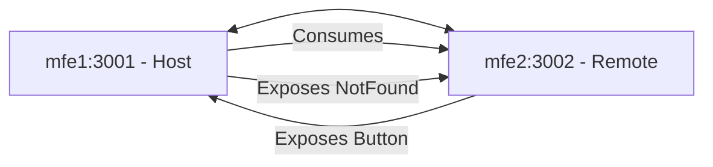

# Micro Frontend Skeleton

A modular micro-frontend architecture demonstrating Module Federation with React applications using Rsbuild.

## 🏗️ Architecture Overview

This repository contains a micro-frontend setup with two applications:

- **mfe1 (Host)** - Main host application that acts as the container
- **mfe2 (Remote)** - Remote application that exposes components to be consumed by the host

### Communication Pattern



## 📚 Tech Stack

### Core Technologies

| Technology            | Version | Purpose                      |
| --------------------- | ------- | ---------------------------- |
| **React**             | 18.3.1  | UI library                   |
| **TypeScript**        | 5.9.3   | Type-safe JavaScript         |
| **Rsbuild**           | ~1.6.x  | Fast Rust-based build tool   |
| **Module Federation** | 0.21.6  | Micro-frontend orchestration |

### MFE1 (Host) - Additional Stack

| Technology       | Version  | Purpose                     |
| ---------------- | -------- | --------------------------- |
| **React Router** | 6.30.2   | Client-side routing         |
| **Zustand**      | 5.0.9    | State management            |
| **TailwindCSS**  | 4.1.17   | Utility-first CSS framework |
| **Radix UI**     | Various  | Accessible UI components    |
| **Lucide React** | 0.555.0  | Icon library                |
| **Motion**       | 12.23.25 | Animation library           |
| **next-themes**  | 0.4.6    | Theme management            |
| **Immer**        | 11.0.1   | Immutable state updates     |

### MFE2 (Remote) - Additional Stack

| Technology       | Version | Purpose             |
| ---------------- | ------- | ------------------- |
| **React Router** | 6.30.2  | Client-side routing |
| **Lucide React** | 0.562.0 | Icon library        |

### Build & Development Tools

- **@rsbuild/plugin-react** - React support for Rsbuild
- **@module-federation/rsbuild-plugin** - Module Federation integration
- **@module-federation/bridge-react** - React bridge for Module Federation
- **@module-federation/enhanced** - Enhanced Module Federation features
- **@module-federation/runtime** - Runtime for Module Federation

### Code Quality

- **ESLint** - Code linting (mfe1)
- **Prettier** - Code formatting (mfe1)
- **TypeScript ESLint** - TypeScript linting rules (mfe1)

## 🚀 Getting Started

### Prerequisites

- **Node.js** 18.x or higher
- **pnpm** (recommended package manager)

If you don't have pnpm installed:

```bash
npm install -g pnpm
```

### Installation

Follow these steps to set up and run both micro-frontends:

#### 1. Install Dependencies

**For mfe1 (Host):**

```bash
cd mfe1
pnpm install
```

**For mfe2 (Remote):**

```bash
cd mfe2
pnpm install
```

#### 2. Environment Configuration

Both applications use environment variables to configure remote endpoints.

**For mfe1:**
Create a `.env.local` file in the `mfe1` directory (optional, defaults are configured):

```env
VITE_MFE2_BASE_URL=http://localhost:3002
VITE_MFE2_SCOPE=remote
```

**For mfe2:**
Create a `.env.local` file in the `mfe2` directory (optional, defaults are configured):

```env
VITE_MFE1_BASE_URL=http://localhost:3001
VITE_MFE1_SCOPE=host
```

#### 3. Running the Applications

> **Important:** You must run **mfe2 first**, then mfe1, because mfe1 (host) depends on mfe2 (remote).

**Step 1 - Start mfe2 (Remote):**

```bash
cd mfe2
pnpm dev
```

This will start mfe2 on `http://localhost:3002`

**Step 2 - Start mfe1 (Host) in a new terminal:**

```bash
cd mfe1
pnpm dev
```

This will start mfe1 on `http://localhost:3001` and automatically open in your browser.

### Accessing the Applications

- **mfe1 (Host):** http://localhost:3001
- **mfe2 (Remote):** http://localhost:3002

## 📦 Module Federation Configuration

### mfe1 (Host) Configuration

- **Name:** `host`
- **Port:** 3001
- **Exposes:**
  - `./NotFound` - 404 Not Found component
- **Consumes:**
  - Remote components from mfe2

### mfe2 (Remote) Configuration

- **Name:** `remote`
- **Port:** 3002
- **Exposes:**
  - `./Button` - Exportable Button component
- **Consumes:**
  - Host components from mfe1

## 🛠️ Available Scripts

### mfe1

| Script         | Command             | Description                              |
| -------------- | ------------------- | ---------------------------------------- |
| `dev`          | `pnpm dev`          | Start development server with hot reload |
| `build`        | `pnpm build`        | Build for production                     |
| `preview`      | `pnpm preview`      | Preview production build                 |
| `clean`        | `pnpm clean`        | Remove dependencies and lock files       |
| `tailwind`     | `pnpm tailwind`     | Watch and compile Tailwind CSS           |
| `format`       | `pnpm format`       | Format code with Prettier                |
| `format:check` | `pnpm format:check` | Check code formatting                    |

### mfe2

| Script    | Command        | Description                              |
| --------- | -------------- | ---------------------------------------- |
| `dev`     | `pnpm dev`     | Start development server with hot reload |
| `build`   | `pnpm build`   | Build for production                     |
| `preview` | `pnpm preview` | Preview production build                 |
| `clean`   | `pnpm clean`   | Remove dependencies and lock files       |

## 🏛️ Project Structure

### mfe1 Structure

```
mfe1/
├── src/
│   ├── components/       # Reusable UI components
│   ├── constants/        # Application constants
│   ├── hooks/            # Custom React hooks
│   ├── lib/              # Utility libraries
│   ├── pages/            # Page components
│   ├── router/           # Routing configuration
│   ├── shared/           # Shared utilities and services
│   ├── store/            # Zustand state management
│   ├── types/            # TypeScript type definitions
│   ├── App.tsx           # Main application component
│   ├── bootstrap.tsx     # Application bootstrap
│   └── index.tsx         # Application entry point
├── rsbuild.config.ts     # Rsbuild configuration
├── tsconfig.json         # TypeScript configuration
└── package.json          # Dependencies and scripts
```

### mfe2 Structure

```
mfe2/
├── src/
│   ├── components/       # Reusable UI components
│   ├── router/           # Routing configuration
│   ├── shared/           # Shared utilities
│   ├── types/            # TypeScript type definitions
│   ├── App.tsx           # Main application component
│   ├── bootstrap.tsx     # Application bootstrap
│   └── index.tsx         # Application entry point
├── rsbuild.config.ts     # Rsbuild configuration
├── tsconfig.json         # TypeScript configuration
└── package.json          # Dependencies and scripts
```

## 🔧 Development Tips

### Hot Module Replacement (HMR)

Both applications support HMR out of the box. Changes to source files will automatically reload in the browser.

### Shared Dependencies

React and React-DOM are configured as singletons to ensure only one instance is loaded across all micro-frontends:

```javascript
shared: {
  react: {
    singleton: true,
    requiredVersion: false,
  },
  'react-dom': {
    singleton: true,
    requiredVersion: false,
  },
}
```

### CORS Configuration

Both applications have CORS enabled for local development to allow cross-origin requests.

### Path Aliases

TypeScript is configured with path aliases for cleaner imports:

- **mfe1 & mfe2:** `@/*` maps to `./src/*`
- **mfe2:** `host/*` maps to `./src/types/host.d.ts` for host type definitions

## 🐛 Troubleshooting

### Issue: mfe1 can't load remote components

**Solution:** Ensure mfe2 is running before starting mfe1. The host needs the remote to be available.

### Issue: Module Federation errors

**Solution:**

1. Clear `node_modules` and `dist` folders in both projects
2. Reinstall dependencies: `pnpm install`
3. Restart both development servers

### Issue: Type errors with remote modules

**Solution:** Check that type declarations in `src/types/` are correctly configured for module federation imports.

## 📝 Additional Resources

- [Module Federation Documentation](https://module-federation.io/)
- [Rsbuild Documentation](https://rsbuild.dev/)
- [React Documentation](https://react.dev/)
- [TailwindCSS Documentation](https://tailwindcss.com/)

## 📄 License

This is a skeleton project for demonstration purposes.

---

**Happy Coding! 🚀**
